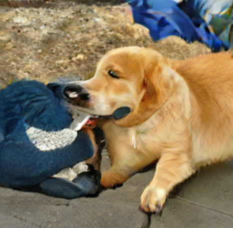
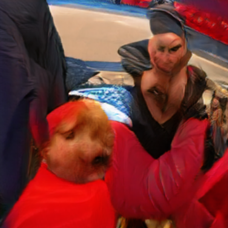
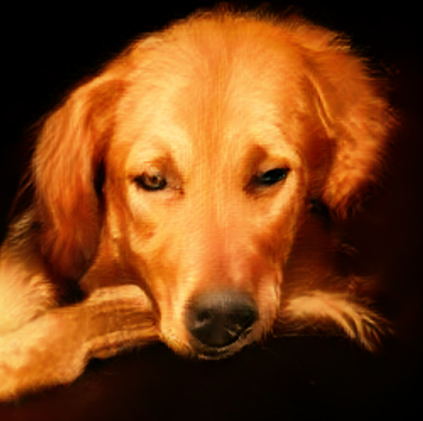
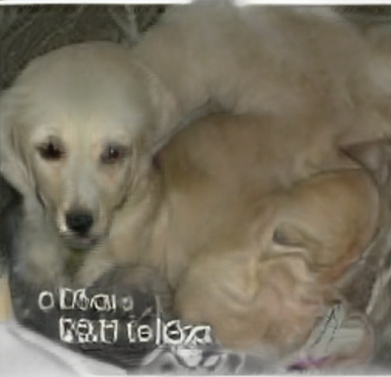

# GAN Image Generation with BigGAN

This project explores the power of **Generative Adversarial Networks (GANs)** using a pretrained **BigGAN model** to generate synthetic images from random noise vectors.

## 📌 Objective

To understand how GANs can generate images from random noise by:
- Loading and interacting with a pretrained GAN model (BigGAN)
- Modifying input latent vectors to observe effects on output
- Reflecting on how different inputs affect the realism and structure of generated images

This project was conducted as part of a hands-on assignment to demonstrate understanding of generative models.

---

## 🧪 Tools & Libraries

This project was built and executed using:
- Python 3.11
- [PyTorch](https://pytorch.org/)
- `pytorch-pretrained-biggan` library
- Jupyter Notebook (can be run via VSCode, Colab, or Anaconda)
- PIL (Python Imaging Library)
- NumPy

### 🔧 Installation

1. Clone the repository or download the notebook.
2. Create a virtual environment (optional but recommended):
   ```bash
   python -m venv venv
   source venv/bin/activate  # On Windows: venv\Scripts\activate
   ```
3. Install dependencies:
   ```bash
   pip install -r requirements.txt
   ```

---

## 📓 How It Works

### 1. Load Pretrained BigGAN
```python
from pytorch_pretrained_biggan import BigGAN, one_hot_from_int, truncated_noise_sample
model = BigGAN.from_pretrained('biggan-deep-256')
```

### 2. Generate an Image of a Specific Class (Golden Retriever - class 207)
```python
latent_vector = torch.from_numpy(truncated_noise_sample(truncation=0.4, batch_size=1))
class_vector = torch.from_numpy(one_hot_from_int([207], batch_size=1))
generated_image = model(latent_vector, class_vector, truncation=0.4)
```

### 3. Experiment with Different Latent Vectors
Try purely random vectors or manually tweak specific values to see how image features change.

```python
latent_vector = torch.randn(1, 128)
latent_vector[0][0] = 3.0
latent_vector[0][10] = -2.0
latent_vector[0][50] = 1.5
```

---

## 🖼️ Example Outputs

| Image | Description |
|-------|-------------|
|  | Truncated latent vector for class 207 (Golden Retriever) |
|  | Raw random latent vector |
|  | Random vector with manually tweaked dimensions |
|  | Variation 2 of random input |
|  | Variation 3 of random input |


---

## 📊 Observations

- Truncated noise (bounded input values) generates more coherent images.
- Random latent vectors result in surreal, abstract, or distorted outputs.
- Manual tweaking of individual vector dimensions can enhance or break symmetry and features.

---

## 💬 Reflection

The model successfully demonstrates how latent space encodes image features. Even small changes in the input vector can lead to drastic variations in generated outputs. However, interpreting latent dimensions directly is nontrivial.

### Limitations:
- Outputs are not always class-consistent or photorealistic.
- Generating large-scale or high-resolution images can require GPU power.

---

## 📁 Files Included

- `gan_notebook.ipynb` – Main notebook with all experiments
- `GAN Reflection Report.pdf` – Written report with results and analysis
- `requirements.txt` – Python dependencies

---

## ✅ How to Run

```bash
jupyter notebook gan_notebook.ipynb
```

Or upload the notebook to [Google Colab](https://colab.research.google.com/) and run each cell step by step.

---

## 📎 License

This project is part of an educational assignment and may include code adapted from public BigGAN documentation and examples.

This repository is licensed under the [MIT License](LICENSE). Feel free to use, modify, and distribute the code under the terms specified.

---

## 🙋‍♀️ Author

Ashlyn Benoy
